# Manual de Usuario — Prototipo CHANDO

Plataforma digital de transformación del canal de marketing de **CHANDO Cosméticos**.
Este manual explica, paso a paso y con capturas de pantalla, cómo usar cada parte del
prototipo (demo).

> **Nota:** es un prototipo de demostración. Los datos son simulados y se guardan en
> memoria mientras la aplicación está abierta; al recargar la página, todo vuelve a su
> estado inicial.

---

## Índice

1. [Cómo iniciar el sistema](#1-cómo-iniciar-el-sistema)
2. [Inicio de sesión (selección de rol)](#2-inicio-de-sesión-selección-de-rol)
3. [Portal del Minorista](#3-portal-del-minorista)
4. [Centro de Control de Inventario](#4-centro-de-control-de-inventario)
5. [Dashboard Ejecutivo](#5-dashboard-ejecutivo)
6. [Cómo se conectan los datos](#6-cómo-se-conectan-los-datos)
7. [Consejos y preguntas frecuentes](#7-consejos-y-preguntas-frecuentes)

---

## 1. Cómo iniciar el sistema

Una vez que el sistema está en ejecución, ábrelo en tu navegador en la dirección:

```
http://localhost:5173
```

> ¿El sistema aún no está corriendo? La instalación y el arranque (requisitos de Node.js y
> comandos `npm`) están en el **[Manual Técnico](MANUAL-TECNICO.md#4-requisitos-instalación-y-ejecución)**.

---

## 2. Inicio de sesión (selección de rol)

Al abrir la aplicación verás la pantalla de inicio. **No se requiere usuario ni
contraseña**: solo eliges con qué perfil quieres entrar.

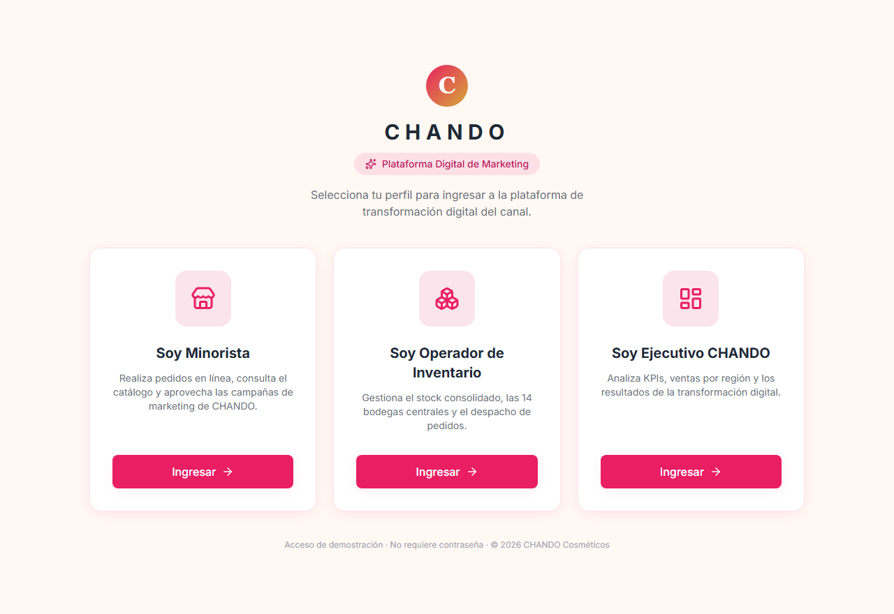

*Figura 1. Pantalla de selección de rol.*

Hay tres perfiles disponibles. Haz clic en **“Ingresar”** dentro de la tarjeta deseada:

| Tarjeta | A dónde entra | Qué puede hacer |
| ------- | ------------- | --------------- |
| **Soy Minorista** | Portal del Minorista | Ver catálogo, armar pedidos y dar seguimiento. |
| **Soy Operador de Inventario** | Centro de Control de Inventario | Vigilar stock de las bodegas y aprobar reabastecimientos. |
| **Soy Ejecutivo CHANDO** | Dashboard Ejecutivo | Ver indicadores, comparativos y generar reportes. |

> Para cambiar de rol en cualquier momento, usa el botón **cerrar sesión** (icono de
> salida, arriba a la derecha) y elige otro perfil.

---

## 3. Portal del Minorista

Es el portal donde un cliente minorista realiza sus compras. A la izquierda está el menú
con tres secciones: **Catálogo**, **Mi Carrito** y **Mis Pedidos**.

### 3.1 Catálogo de productos

Muestra todos los productos en tarjetas. Puedes **buscar por nombre** o **filtrar por
categoría** con los controles de la parte superior.

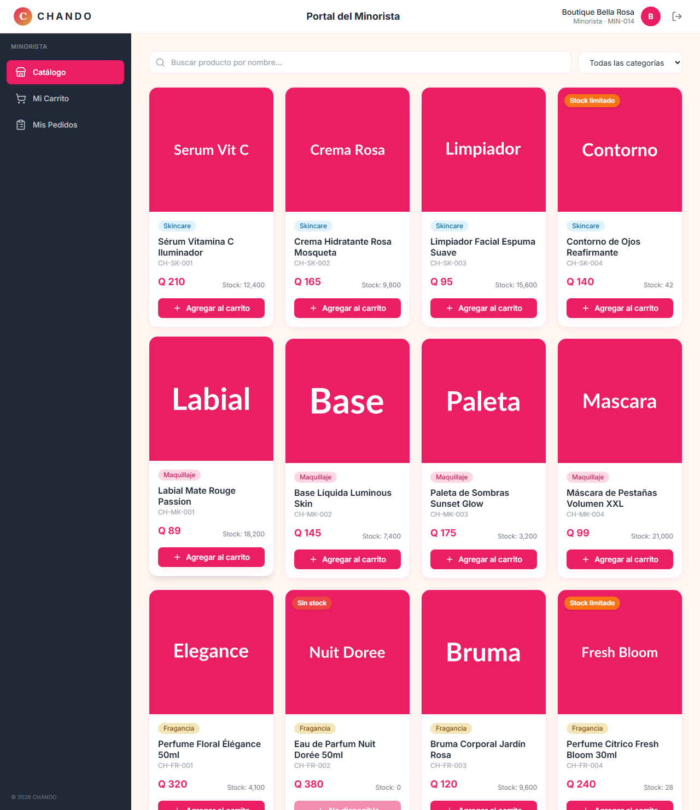

*Figura 2. Catálogo con buscador y filtro por categoría.*

Cada tarjeta muestra imagen, categoría, nombre, SKU, precio y stock disponible. Fíjate en
las etiquetas de stock:

- **Stock limitado** (naranja): quedan menos de 50 unidades.
- **Sin stock** (rojo): el producto está agotado y su botón queda deshabilitado.

Para agregar un producto, haz clic en **“Agregar al carrito”**. Aparecerá una
notificación de confirmación y el contador del carrito (en el menú) aumentará.

### 3.2 Mi Carrito

Entra a **Mi Carrito** desde el menú izquierdo. Aquí revisas lo que vas a pedir.

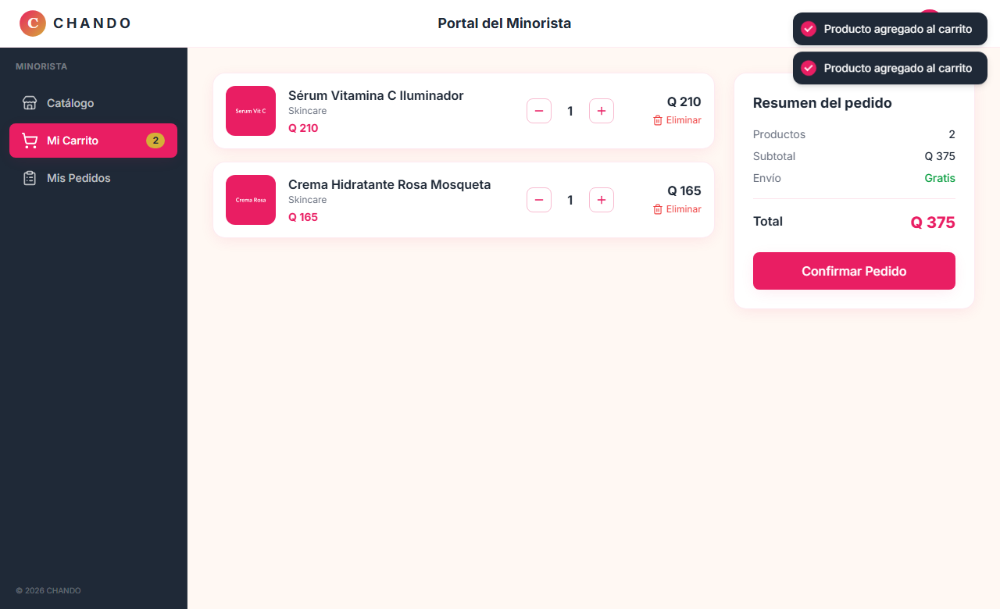

*Figura 3. Carrito con control de cantidades y resumen del pedido.*

- Usa los botones **−** y **+** para cambiar la cantidad de cada producto.
- El botón **Eliminar** quita un producto del carrito.
- A la derecha, el **Resumen del pedido** muestra cantidad de productos, subtotal y total.
- Cuando estés listo, haz clic en **“Confirmar Pedido”**.

### 3.3 Pedido confirmado

Al confirmar, el sistema genera automáticamente un **número de pedido** y le asigna una
**bodega** de despacho. Verás una ventana de confirmación (y una notificación arriba a la
derecha).

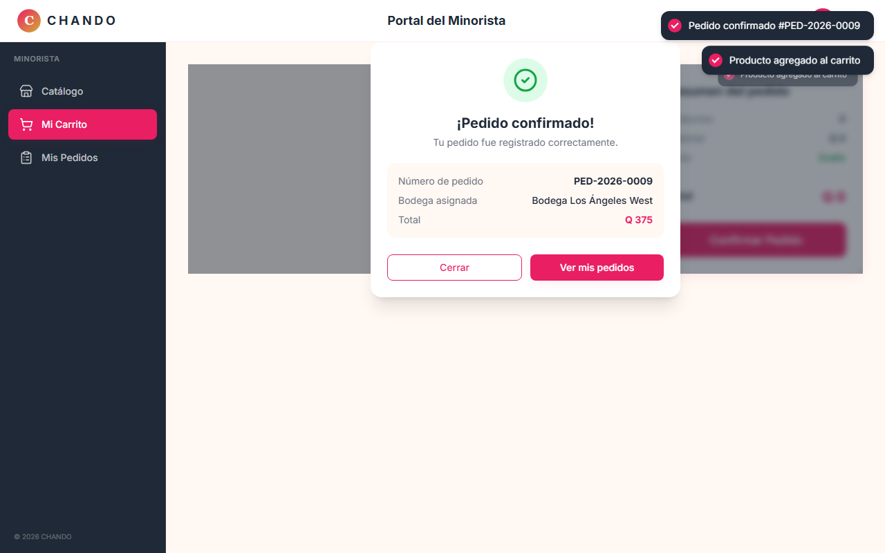

*Figura 4. Confirmación del pedido con número y bodega asignada.*

Puedes pulsar **“Ver mis pedidos”** para ir directamente al seguimiento, o **“Cerrar”**
para seguir comprando. (Al confirmar, el carrito se vacía y el stock se descuenta del
inventario.)

### 3.4 Mis Pedidos

Lista todos los pedidos del minorista, con el más reciente arriba. Puedes **filtrar por
estado** con las pestañas superiores.

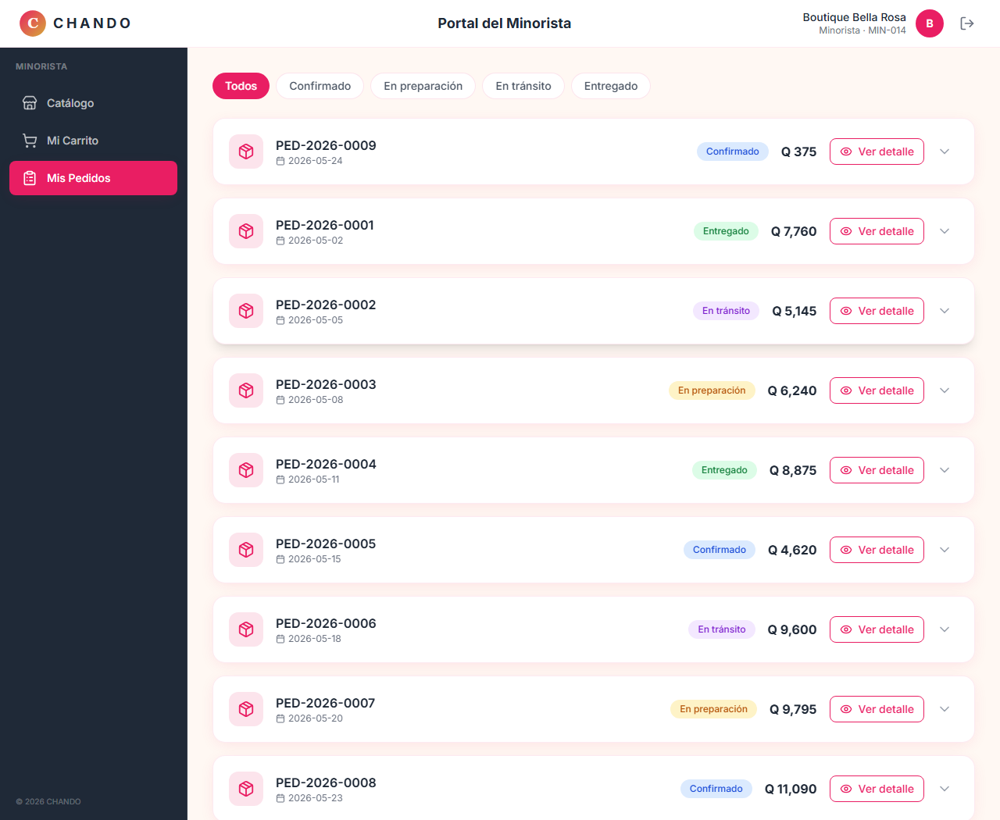

*Figura 5. Mis Pedidos, con filtros por estado y tarjetas expandibles.*

- Cada pedido muestra número, fecha, estado (con color) y total.
- Haz clic en la **flecha** para expandir el pedido y ver su **línea de tiempo**
  (Confirmado → En preparación → En tránsito → Entregado) y la lista de productos.
- El botón **“Ver detalle”** abre una ventana con la información completa del pedido.

---

## 4. Centro de Control de Inventario

Portal del operador de logística. El menú izquierdo tiene: **Vista General**,
**Detalle por Bodega** y **Alertas**.

### 4.1 Vista General

Resumen del estado del inventario en las 14 bodegas centrales.

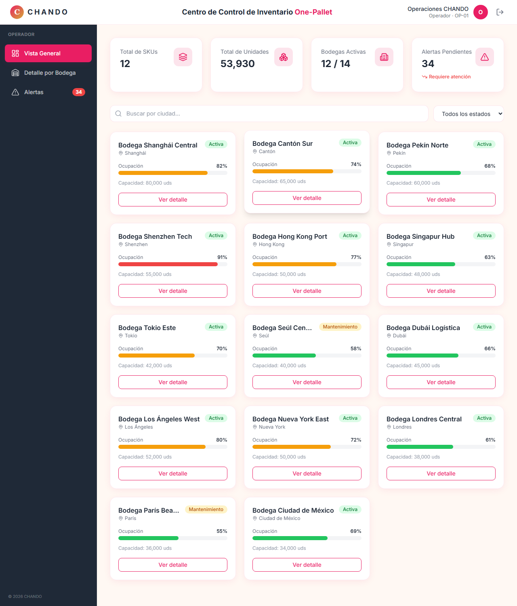

*Figura 6. Métricas principales y mapa de bodegas con colores de ocupación.*

- Arriba, 4 métricas: **Total de SKUs**, **Total de Unidades**, **Bodegas Activas** y
  **Alertas Pendientes** (se calculan en tiempo real).
- Abajo, una tarjeta por bodega con una **barra de ocupación** en colores tipo semáforo:
  - **Verde**: ocupación menor a 70 %.
  - **Amarillo**: entre 70 % y 90 %.
  - **Rojo**: mayor a 90 %.
- Puedes **buscar por ciudad** o **filtrar por estado** (activa / mantenimiento).
- El botón **“Ver detalle”** de cada bodega te lleva a su detalle.

### 4.2 Detalle por Bodega

Muestra todos los productos almacenados en una bodega. Usa el **selector** de la parte
superior para cambiar de bodega.

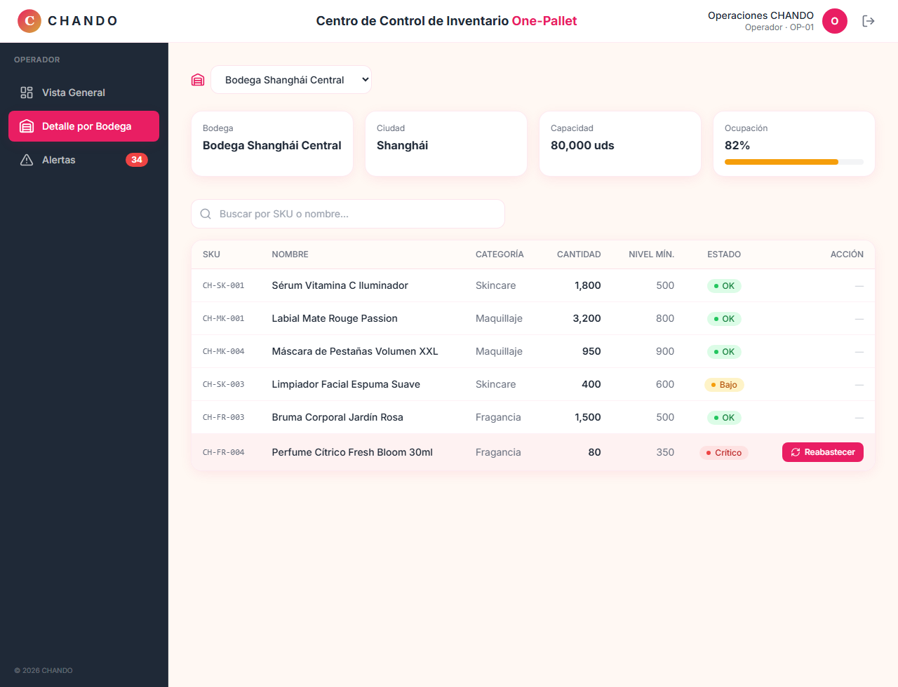

*Figura 7. Tabla de productos por bodega con estado de stock.*

- Información general de la bodega: nombre, ciudad, capacidad y ocupación.
- La tabla lista SKU, nombre, categoría, cantidad, nivel mínimo y **estado**:
  - **OK** (verde), **Bajo** (amarillo) o **Crítico** (rojo).
- Las filas en estado **Crítico** se resaltan en rojo y muestran el botón
  **“Reabastecer”** para solicitar reposición.
- Puedes **buscar por SKU o nombre** dentro de la bodega.

### 4.3 Alertas de Reabastecimiento

Concentra todos los productos con stock bajo o crítico que requieren atención.

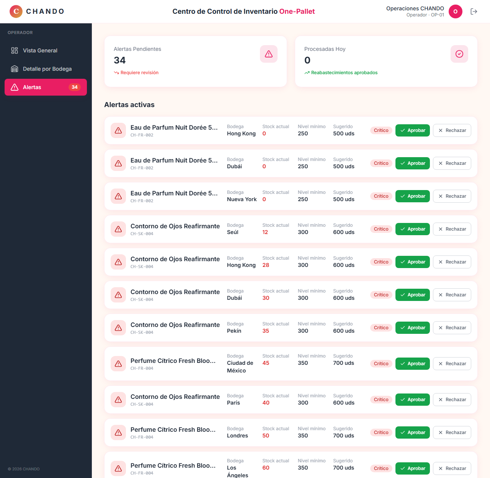

*Figura 8. Alertas con cantidad sugerida y acciones de aprobar/rechazar.*

- Arriba se muestran las **alertas pendientes** y las **procesadas hoy**.
- Cada alerta indica el producto, SKU, bodega, stock actual, nivel mínimo y la
  **cantidad sugerida** de reposición (el doble del nivel mínimo).
- **“Aprobar”**: suma stock al inventario (la alerta desaparece y aumenta el contador de
  procesadas). Aparece una notificación de éxito.
- **“Rechazar”**: descarta la alerta sin reponer stock.

---

## 5. Dashboard Ejecutivo

Vista de dirección con indicadores del negocio. El menú tiene: **KPIs**,
**Análisis Comparativo** y **Reportes**. En el encabezado hay un **selector de rango de
fechas** (7 días, 30 días, 90 días, Año).

### 5.1 KPIs Principales

Panel con los indicadores clave y varios gráficos.

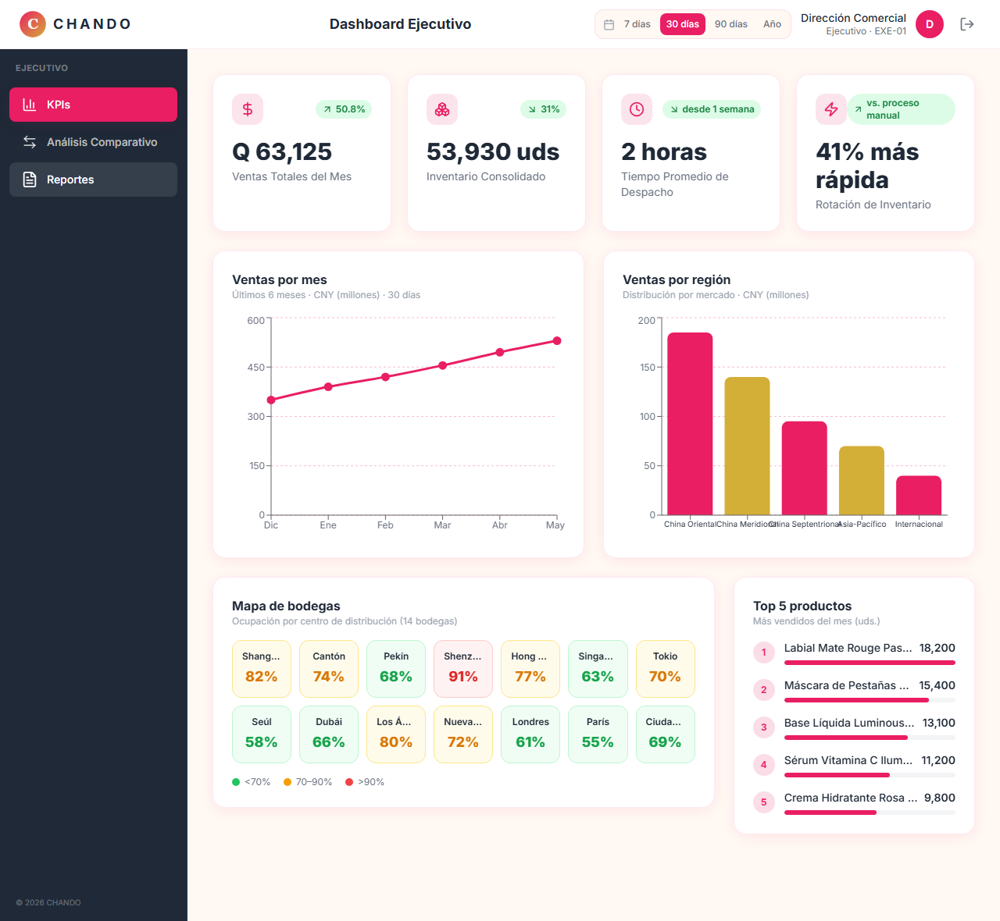

*Figura 9. KPIs, gráficos de ventas, mapa de bodegas y top de productos.*

- **4 tarjetas de KPI**: Ventas Totales del Mes e Inventario Consolidado **se calculan**
  a partir de los datos reales del sistema; Tiempo de Despacho y Rotación reflejan la
  transformación lograda.
- **Ventas por mes**: gráfico de líneas con la evolución de los últimos 6 meses.
- **Ventas por región**: gráfico de barras por mercado.
- **Mapa de bodegas**: cuadrícula de las 14 bodegas coloreadas según su ocupación.
- **Top 5 productos**: los más vendidos del mes.

### 5.2 Análisis Comparativo

Compara la operación **antes y después** de la transformación digital.

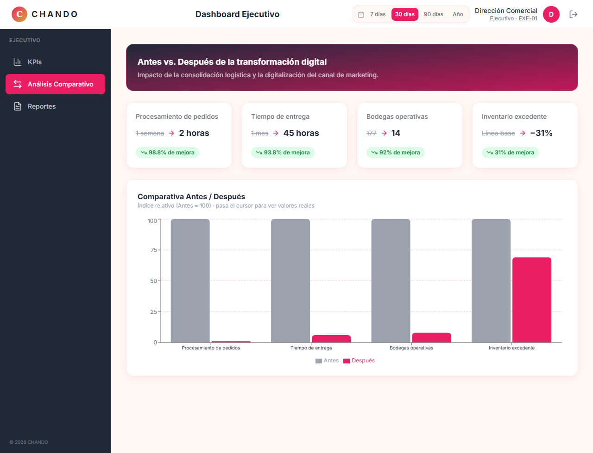

*Figura 10. Tarjetas de mejora y gráfico de barras Antes vs. Después.*

- Tarjetas con el cambio en cada métrica (por ejemplo, procesamiento de pedidos de
  1 semana a 2 horas) y su porcentaje de mejora.
- Un gráfico de barras agrupadas compara cada métrica. Al pasar el cursor sobre las
  barras se muestran los valores reales.

### 5.3 Reportes

Generador de reportes ejecutivos.

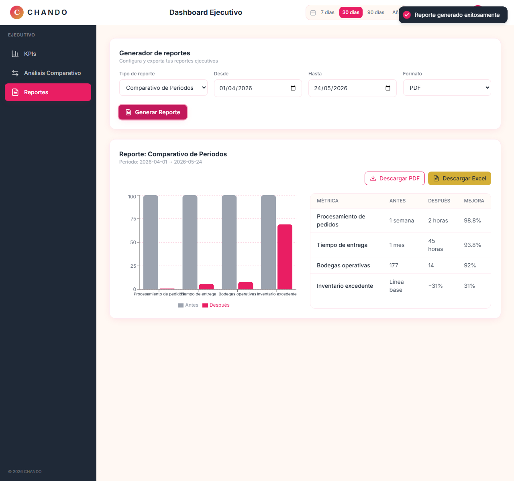

*Figura 11. Formulario de reporte y vista previa con gráfico y tabla.*

1. Elige el **tipo de reporte** (Comparativo de Periodos, Ventas por Región o
   Evolución de KPIs).
2. Selecciona el **rango de fechas** (desde / hasta).
3. Elige el **formato** (PDF o Excel).
4. Haz clic en **“Generar Reporte”**: aparece una vista previa con un gráfico y una tabla,
   más una notificación de éxito.
5. Usa **“Descargar PDF”** o **“Descargar Excel”** para exportar (en el prototipo, la
   descarga es simulada y solo muestra una notificación).

---

## 6. Cómo se conectan los datos

Aunque cada rol entra a su propio módulo, comparten el mismo inventario en memoria. Por eso
las acciones de un rol se ven reflejadas en los demás:

1. **El minorista confirma un pedido** → se **descuenta** del inventario y aumentan las
   ventas.
2. **El operador aprueba un reabastecimiento** → se **suma** stock al inventario.
3. **El ejecutivo** ve cómo sus KPIs (Inventario Consolidado y Ventas Totales) **cambian**
   según esas acciones, porque se calculan desde los mismos datos.

> Sugerencia para la demostración: arma y confirma un pedido como Minorista, luego entra
> como Operador y aprueba una alerta, y por último entra como Ejecutivo para ver los KPIs
> actualizados. (Si recargas la página completa, el estado se reinicia.)

---

## 7. Consejos y preguntas frecuentes

- **Notificaciones (toasts):** cada acción importante muestra un aviso en la esquina
  superior derecha (producto agregado, pedido confirmado, reabastecimiento aprobado,
  reporte generado).
- **Diseño adaptable:** la interfaz funciona en computadora, tablet (768 px) y móvil
  (375 px). En pantallas pequeñas el menú lateral se muestra como una barra de iconos.
- **Cerrar sesión:** botón con icono de salida en la esquina superior derecha; regresa a
  la pantalla de selección de rol.
- **¿Los datos se guardan?** No. Es un prototipo: los cambios viven en memoria y se
  reinician al recargar la página o reiniciar el servidor.

---

_Proyecto académico — Análisis de Sistemas 1, UMG. © 2026 CHANDO Cosméticos (ejemplo ficticio)._
